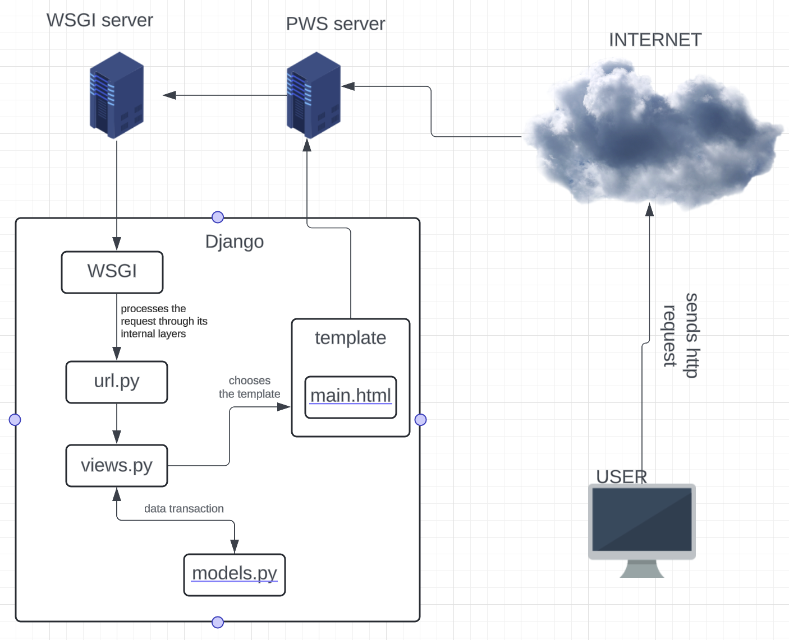
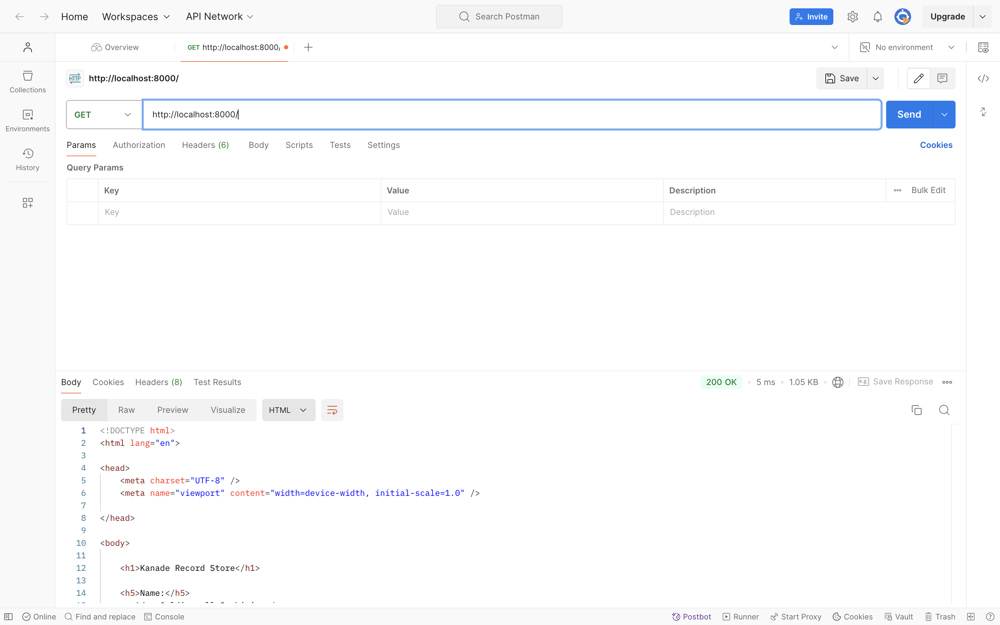
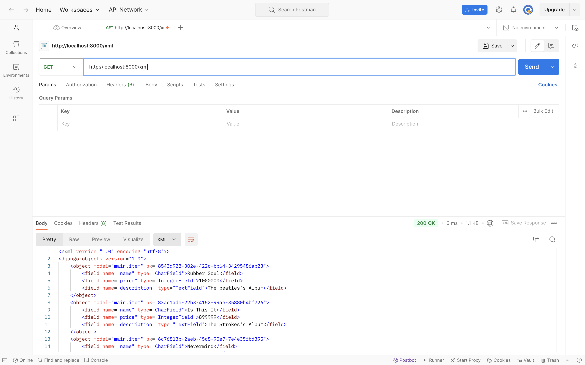
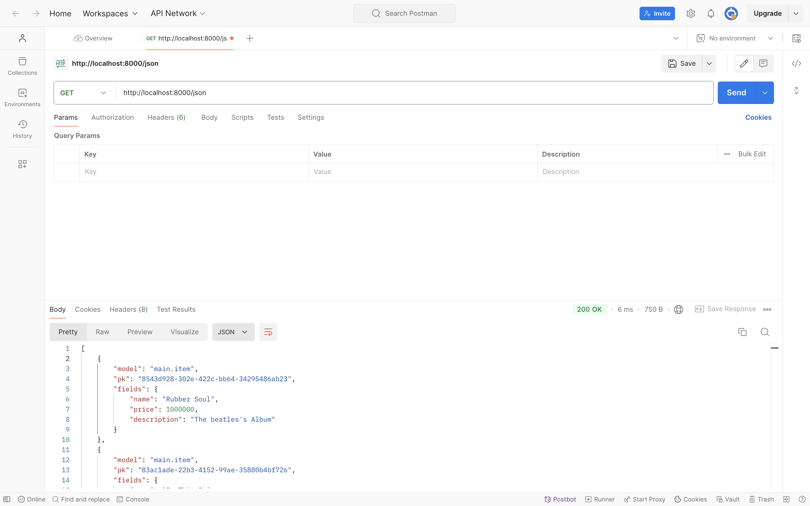
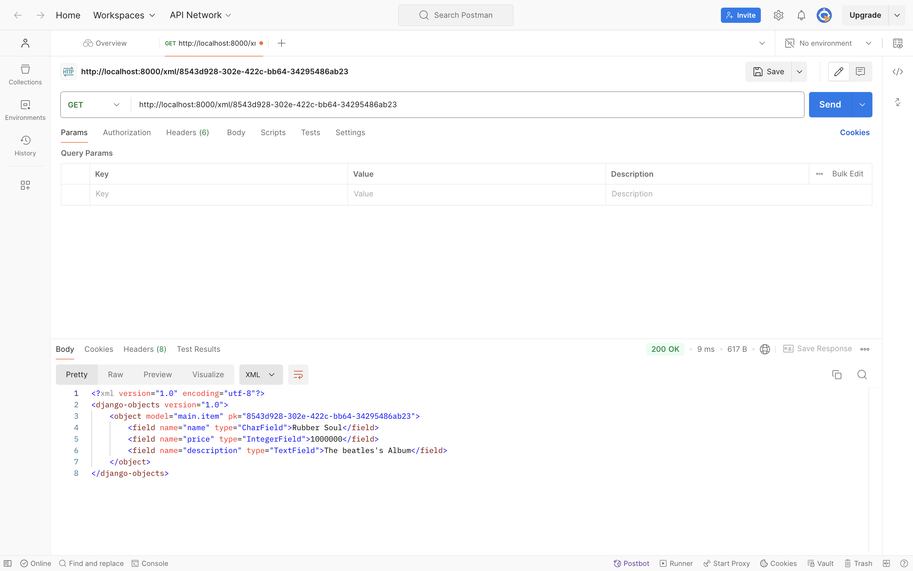
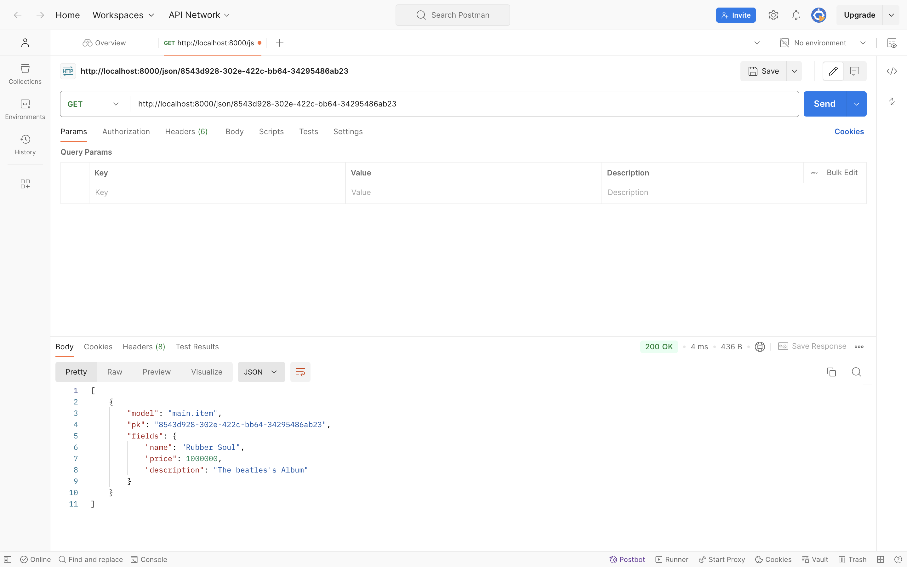

# Kanade Record Store

> **Kanade Record Store** adalah aplikasi penjualan dan pembelian rilisan fisik sepert vinyl, tape, dll untuk kawula muda yang kalcer abiez.

## 💿🥁🎹**Link**🎸🎻🎼
[Kunjungin laman Kanade Record Store](http://adam-caldipawell-kanaderecordstore.pbp.cs.ui.ac.id/)

<details>
<summary> <b> Tugas 2: Implementasi Model-View-Template (MVT) pada Django </b> </summary>

## Langkah langkah implementasi Kanade Record Store

### 1. Membuat Directory Baru dan Menginisialisasi Git
1. Buat directory baru bernama `kanade-record-store`.
2. Inisialisasi repositori Git dan hubungkan ke GitHub:
    ```bash
    git init
    git remote add origin <URL>
    git add .
    git commit -m "Initial commit"
    git push origin master
    ```

### 2. Membuat Virtual Environment
1. Jalankan perintah berikut untuk membuat virtual environment:
    ```bash
    python -m venv env
    ```
2. Aktifkan virtual environment:
    - **Linux/macOS**:
        ```bash
        source env/bin/activate
        ```
    - **Windows**:
        ```bash
        env\Scripts\activate
        ```

### 3. Membuat dan Menginstall Requirements
1. Buat file `requirements.txt` yang berisi daftar package yang diperlukan.
2. Jalankan perintah berikut untuk menginstal package:
    ```bash
    pip install -r requirements.txt
    ```

### 4. Membuat Proyek Django
1. Buat proyek Django baru dengan nama `kanade_record_store`:
    ```bash
    django-admin startproject kanade_record_store
    ```
2. Buat aplikasi baru dengan nama `main`:
    ```bash
    django-admin startapp main
    ```

### 5. Mengupdate `settings.py`
1. Tambahkan aplikasi `main` ke dalam list `INSTALLED_APPS` di `settings.py` agar aplikasi tersebut terdaftar di proyek.
2. Tambahkan `"localhost"`, `"127.0.0.1"` ke dalam list `ALLOWED_HOSTS` untuk mengakses aplikasi secara lokal saat pengembangan.

### 6. Membuat View dan Template
1. Tambahkan kode berikut pada `views.py`:
    ```python
    from django.shortcuts import render

    def show_main(request):
        context = {
            'nama': 'Adam Caldipawell Sembiring',
            'class': 'PBP F'
        }
        return render(request, "main.html", context)
    ```
2. Di `urls.py`, tambahkan `path('', include('main.urls'))` pada `urlpatterns` agar URL aplikasi `main` bisa diakses.
3. Di folder `main`, buat folder bernama `templates` dan buat file `main.html` yang menampilkan nama e-commerce, nama, dan kelas.

### 7. Membuat Model Produk
1. Di `models.py`, buat model produk dengan atribut berikut:
    - `name`: CharField
    - `price`: IntegerField
    - `description`: TextField
      
### 8. Melakukan migration pada model
1. Pindah ke directory utama
2. Jalankan migration pada terminal:
   ```bash
   python manage.py makemigrations
   python manage.py migrate
   ```
### 9. Deploy ke PWS (Pacil Web Service)
1. Buat project baru di PWS dengan nama `kanaderecordstore` dan simpan credential information.
2. Di `settings.py`, tambahkan URL `adam-caldipawell-kanaderecordstore.pbp.cs.ui.ac.id/` ke dalam list `ALLOWED_HOSTS`.
3. Simpan perubahan dengan menjalankan:
    ```bash
    git add .
    git commit -m "Deploy to PWS"
    git push origin master
    ```
4. Tambahkan remote PWS:
    ```bash
    git remote add pws http://pbp.cs.ui.ac.id/adam.caldipawell/kanaderecordstore
    git branch -M master
    git push pws master
    ```

### 10. Aplikasi Django Terdeploy
Aplikasi sekarang bisa diakses melalui URL:  
[http://adam-caldipawell-kanaderecordstore.pbp.cs.ui.ac.id/](http://adam-caldipawell-kanaderecordstore.pbp.cs.ui.ac.id/)

## Bagan Proses Request Client ke Web Aplikasi

Berikut adalah alur proses dari request client ke web aplikasi berbasis Django:



### Penjelasan
1. Ketika user mengirimkan HTTP request ke server PWS, request tersebut diteruskan ke WSGI server.
2. WSGI server meneruskan request tersebut ke Django.
3. `urls.py` mendeteksi URL request dan menghubungkannya dengan views yang sesuai.
4. `views.py` memproses request dan mengambil data dari `models.py`.
5. `views.py` kemudian mengirimkan response berupa template HTML (`main.html`) yang akan dikembalikan ke user sebagai response.

## Fungsi Git dalam Pengembangan Perangkat Lunak
Git berfungsi sebagai version control dalam pengembangan perangkat lunak. Dengan Git, kita dapat melacak setiap perubahan kode yang dilakukan, memudahkan proses kolaborasi, dan memungkinkan rollback ke versi sebelumnya jika terjadi kesalahan.

## Mengapa Django Digunakan sebagai Permulaan Pembelajaran?
Django menggunakan bahasa Python yang relatif mudah dipahami. Django menawarkan arsitektur MVT (Model, View, Template), yang memisahkan komponen UI (template), logika aplikasi (view), dan akses database (model), sehingga memudahkan pengembangan terstruktur. Django juga memudahkan pengembang untuk membangun aplikasi yang skalabel.

## Mengapa Model di Django Disebut sebagai ORM?
Django menggunakan ORM (Object-Relational Mapping), yang memodelkan data dari database relasional menjadi objek di Python. Ini memungkinkan pengembang untuk berinteraksi dengan database tanpa harus menulis query SQL secara eksplisit, melalui QuerySet API yang disediakan oleh Django.
</details>

<details>
<summary> <b> Tugas 3: Implementasi Form dan Data Delivery pada Django </b> </summary>
    
## Mengapa kita memerlukan *data delivery* dalam pengimplementasian sebuah platform?

Dalam pembuatan platform, tidak jarang ada kebutuhan untuk mengirim ataupun menerima data. Implementasi sebuah platform yang memiliki mekanisme *data delivery* dapat membuat sebuah platform lebih interaktif dan dinamis. 

## Mana yang lebih baik antara XML dan JSON? Mengapa JSON lebih populer dibandingkan XML?

| Format       | XML                                                                 | JSON                                                                                     |
|--------------|---------------------------------------------------------------------|------------------------------------------------------------------------------------------|
| Perbandingan | XML adalah bahasa mark up yang memiliki aturan dalam pendefinisian data. XML menggunakan tag yang memisahkan nama data dan nilai data. | JSON adalah format pertukaran data yang mudah dibaca oleh komputer dan manusia. JSON menyimpan data dengan pasangan string key dan value. JSON juga banyak didukung oleh bahasa pemrograman. |
| Sintaks      | `<tag>nilai</tag>`                                                  | `{nama: 'Adam'}`                                                                          |

Dalam konteks pemrograman platform web, JSON lebih baik dan lebih populer dibandingkan dengan XML dengan kelebihan berikut:

1. Sintaks JSON yang lebih ringkas, ringan, dan mudah untuk dibaca.
2. JSON mendukung berbagai tipe data, contohnya array.
3. JSON lebih cepat dibandingkan XML karena pada pemrograman web, JavaScript memiliki fungsi bawaan yang dapat parsing JSON menjadi JavaScript object.
4. JSON didukung oleh banyak bahasa pemrograman karena kemudahan yang diberikan.


## Jelaskan fungsi dari method `is_valid()` pada form Django dan mengapa kita membutuhkan method tersebut?

Validasi form model secara otomatis akan dilakukan oleh Django melalui pemanggilan fungsi `is_valid()' untuk memastikan kebenaran input yang diberikan.

##  Mengapa kita membutuhkan csrf_token saat membuat form di Django? Apa yang dapat terjadi jika kita tidak menambahkan csrf_token pada form Django? Bagaimana hal tersebut dapat dimanfaatkan oleh penyerang?

Cross-Site Request Forgery (csrf) adalah salah satu metode dalam penyerangan keamanan suatu website. Pada `tugas 3`, kita diminta untuk membuat suatu form yang kemudian dapat dikirimkan ke DJango (webserver) melalui request POST. Jika tidak ada `csrf_token` maka seorang attacker bisa saja melakukan request POST ini tanpa melalui website kanade record store. Saat seseorang ingin menambahkan object melalui form, Django akan mengirimkan `csrf_token` saat membuka laman `/create-item-entry` kemudian ketika form tersebut disubmit maka request POST + `csrf_token` akan dikirimkan ke Django kembali yang memastikan bahwa pengiriman data dilakukan di website kanade record store.

## Implementasi *data delivery*

### Implementasi skeleton sebagai kerangka views
1. Pertama saya membuat directory `templates` di `root directory`.
2. Membuat sebuah file html sebagai skeleton, `base.html` dengan kode berikut:
   ```html
    
    <!DOCTYPE html>
    <html lang="en">
      <head>
        <meta charset="UTF-8" />
        <meta name="viewport" content="width=device-width, initial-scale=1.0" />
         
      </head>

      <body>
         
      </body>
    </html>
   ```
3. Pada `settings.py` di `kanade_record_store`. Pada variabel `TEMPLATES`. Ubah menjadi
   ```python
   TEMPLATES = [
    {
        'BACKEND': 'django.template.backends.django.DjangoTemplates',
        'DIRS': [BASE_DIR / 'templates'],
        'APP_DIRS': True,
        'OPTIONS': {
            'context_processors': [
                'django.template.context_processors.debug',
                'django.template.context_processors.request',
                'django.contrib.auth.context_processors.auth',
                'django.contrib.messages.context_processors.messages',
                ],
            },
        },
    ]
   ```
Langkah - langkah ini memberitahu Django untuk menggunakan base.html sebagai skeleton. Sehingga kedepannya yang perlu dilakukan untuk mengubah isi html adalah mengisi  <b> *isi disini* </b> . Sehingga tampilan untuk pengguna tetap dinamis dan minim redudansi.
### Menambahkan UUID sebagai id untuk object model
1. Pergi ke `./main` lalu ubah models.py menjadi:
   ```python
    import uuid

    class Item(models.Model):
        id = models.UUIDField(primary_key=True, default=uuid.uuid4, editable=False)
        name = models.CharField(max_length=255)
        price = models.IntegerField(default=0)
        description = models.TextField(default="")
   ```
2. Migrasi model baru dengan menjalankan:
   ```bash
    python3 manage.py makemigrations
    python3 manage.py migrate
   ```
Pemberian ID dimaksudkan agar setiap object memiliki sebuah *identifier* yang berbeda - beda. Penggunaan UUID adalah salah satu upaya untuk mencegah serangan IDOR.

### Membuat form untuk menambahkan object 
1. Pada directory `main` saya menambahkan `forms.py`. Pembuatan `forms.py` dilakukan untuk membuat struktur *form* sederhana sesuai dengan `models.Item`:
   ```python
    from django.forms import ModelForm
    from main.models import Item
    
    class ItemEntryForm(ModelForm):
        class Meta:
            model = Item
            fields = ["name", "price", "description"]
   ```
   `model = Item` memberitahu ke Django bahwa gunakan Item sebagai model saat pengisian *form*
   `fields = ["name", "price", "description"]` mendefinisikan field yang akan diisi user. <b>ID digenerate secara otomatis oleh UUID</b>
2. Membuat template baru untuk tampilan dalam menambahkan item baru dengan nama `create_item.html` pada direktori `main/template`:
    ```html
     
    
    <h1>Add New Item Entry</h1>
    
    <form method="POST">
      
      <table>
        {{ form.as_table }}
        <tr>
          <td></td>
          <td>
            <input type="submit" value="Add Item" />
          </td>
        </tr>
      </table>
    </form>
    
    
    ```
4. Pada berkas `views.py` di directory yang sama. Saya menambahkan sebuah fungsi `create_item_entry` untuk untuk menampilkan *form*:
   ```python
   ...
   from django.shortcuts import render, redirect #redirect untuk mengembalikan user ke halaman utama setelah pengisian *form*
   from main.forms import ItemEntryForm
   from main.models import Item
   
    def create_item_entry(request):
        form = ItemEntryForm(request.POST or None)
    
        if form.is_valid() and request.method == "POST":
            form.save()
            return redirect('main:show_main')
    
        context = {'form': form}
        return render(request, "create_item_entry.html", context)
   ```
   `form = MoodEntryForm(request.POST or None)` digunakan untuk membuat ItemEntryForm baru dengan memasukkan QueryDict berdasarkan input dari user pada request.POST.
   `form.is_valid()` digunakan untuk memvalidasi isi input dari form tersebut.
   `form.save()` digunakan untuk membuat dan menyimpan data dari form tersebut.
   `return redirect('main:show_main')` digunakan untuk melakukan redirect ke fungsi show_main pada views aplikasi main setelah data form berhasil disimpan.
5. Pada berkas yang sama, ubah fungsi `show_main`:
   ```python
   ...
   def show_main(request):
    items = Item.objects.all()
    context = {
        'name' : 'Adam Caldipawell Sembiring',
        'class' : 'PBP F',
        'items' : items,
    }
    return render(request, "main.html", context)
   ```
   Setiap item yang dibuat akan ditampilkan saat kembali ke halaman utama. Seluruh item diakses melalui `items = Item.objects.all()`.
6. Mengubah template untuk tampilan utama `main.html` pada direktori `main/template`:
    ```html
    
    
    <h1>Kanade Record Store</h1>
    
    <h5>Name:</h5>
    <p>{{ name }}</p>
    
    <h5>Class:</h5>
    <p>{{ class }}</p>
    
    
    <p>Belum ada data item pada Kanade Record Store.</p>
    
    <table>
      <tr>
        <th>Name</th>
        <th>Price</th>
        <th>Description</th>
      </tr>
    
       Berikut cara memperlihatkan data mood di bawah baris ini 
       
      
      <tr>
        <td>{{item.name}}</td>
        <td>{{item.price}}</td>
        <td>{{item.description}}</td>
      </tr>
      
    </table>
    
    
    <br />
    
    <a href="">
      <button>Add New Item Entry</button>
    </a>
    
    
    ```
### Mengembalikan data dalam bentuk XML dan JSON
Untuk mengembalikan data dalam format XML dan JSON, Saya menggunakan `serializers` dan `HttpResponse`
```python
from django.http import HttpResponse
from django.core import serializers
...
```
<b>Mengembalikan Format XML</b>
```python
...
def show_xml(request):
    data = Item.objects.all()
    return HttpResponse(serializers.serialize("xml", data), content_type="application/xml")
...
```
<b>Mengembalikan Format JSON</b>
```python
...
def show_json(request):
    data = Item.objects.all()
    return HttpResponse(serializers.serialize("json", data), content_type="application/xml")
...
```
### Mengembalikan data dalam bentuk XML dan JSON sesuai [id]
Untuk mengembalikan data sesuai dengan ID object tersebut maka:

<b>Mengembalikan Format XML by id</b>

```python
...
def show_xml_by_id(request, id):
    data = Item.objects.filter(pk=id)
    return HttpResponse(serializers.serialize("xml", data), content_type="application/xml")
...
```

<b>Mengembalikan Format JSON by id</b>

```python
...
def show_json_by_id(request, id):
    data = Item.objects.filter(pk=id)
    return HttpResponse(serializers.serialize("json", data), content_type="application/json")
...
```
### Membuat routing URL untuk masing-masing views yang telah ditambahkan

```python
from django.urls import path
from main.views import show_main, create_item, show_xml, show_json, show_xml_by_id, show_json_by_id 

app_name = 'main'

urlpatterns = [
    path('', show_main, name='show_main'),
    path('create-item', create_item, name='create_item'),
    path('xml/', show_xml, name='show_xml'), 
    path('json/', show_json, name='show_json'),
    path('xml/<int:id>/', show_xml_by_id, name='show_xml_by_id'),
    path('json/<int:id>/', show_json_by_id, name='show_json_by_id'),  
]
```

### Melakukan push ke github dan pws
```bash
git add .
git commit -m"tugas 3"
git push origin master
git push pws master
```
Sehingga aplikasi bisa dilihat di [website ini](http://adam-caldipawell-kanaderecordstore.pbp.cs.ui.ac.id/)

### Membuat *screenshot* menggunakan POSTMAN
1. HTML

2. XML

3. JSON

4. XML by ID

5. JSON by ID

source:
1. [Django DOCS](https://docs.djangoproject.com/)
2. [Slide Data Delivery](https://scele.cs.ui.ac.id/pluginfile.php/238122/mod_resource/content/1/04%20-%20Data%20Delivery.pdf)
3. [CSRF by computerphile](https://youtu.be/vRBihr41JTo?si=oXlMrDMj3HlvRsOU)
4. [Tutorial 2](https://pbp-fasilkom-ui.github.io/ganjil-2025/docs/tutorial-2)

</details>

<details>
<summary> <b> Tugas 4: Implementasi Autentikasi, Session, dan Cookies pada Django </b> </summary>


## Apa perbedaan antara `HttpResponseRedirect()` dan `redirect()`
`HttpResponseRedirect` adalah *class* dari modul django.http yang mengembalikan respons pengalihan HTTP dengan kode status 302 (Found). Kode status ini menunjukkan bahwa pengguna atau klien akan dialihkan ke URL baru. *class* ini menerima parameter berupa URL tujuan yang spesifik dan sangat berguna jika kita ingin mengarahkan pengguna ke URL statis atau memerlukan logika pengalihan yang lebih kompleks.

Sementara itu, `redirect()` adalah fungsi dari modul django.shortcuts yang memberikan cara yang lebih sederhana dan fleksibel untuk melakukan pengalihan. Parameter yang diterima bisa berupa string URL, nama view, atau objek model, yang kemudian dikonversi oleh Django menjadi URL.

Perbedaan utama antara `HttpResponseRedirect` dan redirect terletak pada jenis parameter yang diterima. `HttpResponseRedirect` hanya menerima URL yang spesifik, sementara redirect lebih fleksibel karena dapat menerima URL, nama view, atau objek model yang akan secara otomatis dikonversi menjadi URL tujuan.

## Apa perbedaan antara authentication dan authorization, apakah yang dilakukan saat pengguna login? Jelaskan bagaimana Django mengimplementasikan kedua konsep tersebut?
Authentication adalah proses untuk memastikan identitas pengguna. Misalnya, dalam kanade record store, Hanya pengguna yang memasukan username dan password yang sesuai memiliki akses pada akun yang berisi data - data entry. 

Sementara itu, authorization adalah proses untuk memastikan hak akses yang sesuai pada pengguna yang telah diauthentication. Jadi, pengguna yang telah login, hanya bisa mendapat akses akun yang bersangkutan. Hal ini mencegah pihak yang tidak bersangkutan dengan data yang kita miliki, tidak dapat melakukan modifikasi terhadap data tersebut.

Secara umum, ketika pengguna ingin login pada suatu aplikasi. Pengguna diminta untuk memasukan username dan password. Pada tahap ini, pengguna akan diauthentication. Pengguna tidak akan mendapat akses terhadap akun apabila memberikan username dan password yang salah. Pengguna yang telah masuk pun hanya mendapat akses modifikasi pada akun bersangkutan.

Django sendiri memudahkan authentication dan authorization dengan menyediakan fungsi dan class bawaan. Sistem ini menyediakan model untuk user dan group. Kemudian, ada juga views untuk login dan registrasi. Modul yang digunakan sendiri adalah `django.contrib.auth`. Lebih spesifik lagi terdapat fungsi `authenticate` yang menerima 3 argumen, yaitu request, username, password. Fungsi tersebut mengembalikan user jika argumen yang diberikan benar. Sementara itu, django juga menyediakan fitur authorization berupa penggunaan middleware untuk mengatur user sessionsd dan permissions.

## Bagaimana Django mengingat pengguna yang telah login? Jelaskan kegunaan lain dari cookies dan apakah semua cookies aman digunakan?

Ketika ada pengguna yang telah login dan agar tetap login. Django menyediakan frameword session untuk menyimpan data user yang sedang login di server. Setiap user yang berhasil login akan diberikan cookie yang berisi SessionID, last login, atau csrf token. Kemudian, apabila pengguna logout, django akan menghapus session. sehingga, ketika memasuki website, pengguna perlu login ulang.

Beberapa fungsi lain dari cookies meliputi:

1. Menyimpan preferensi pengguna selama menjelajahi situs web, seperti pengaturan antarmuka atau bahasa.
2. Melacak aktivitas pengguna di situs untuk mempersonalisasi konten atau iklan yang ditampilkan, misalnya konten media sosial atau iklan yang relevan dengan minat pengguna.
3. Menganalisis perilaku pengguna di situs web, seperti minat atau durasi kunjungan, guna meningkatkan kualitas situs.

Pada sisi keamanan, Tidak semua cookie aman bagi pengguna. Misalnya, cookie yang menyimpan informasi penting seperti token autentikasi dapat diakses oleh JavaScript di situs web, atau cookie yang disetel oleh pihak ketiga. Cookie yang tidak dilindungi rentan terkena serangan Cross-Site Scripting (XSS). Untuk mitigasi masalah ini, django menyediakan beberapa fitur. Secure mengirim cookie hanya melalui HTTPS reques dan HttpOnly yang mencegah cookie diakses melalui JavaScript.

## Jelaskan cara kerja penghubungan model Product dengan User!
Model Item sendiri dihubungkan dengan model User melalui ForeignKey. ForeignKey menghubungkan setiap pengguna dengan Item yang dibuat oleh pengguna tersebut.

Implementasi dalam project:
```python
...
class Item(models.Model):
    user = models.ForeignKey('auth.User', on_delete=models.CASCADE)
    id = models.UUIDField(primary_key=True, editable=False, default=uuid.uuid4)
    name = models.CharField(max_length=100)
    price = models.IntegerField()
    description = models.TextField(max_length=500)
...
```
Pengguna yang telah login, dapat menambah entri Item. Dimana setiap entri yang dibuat tersebut diasoasiasikan melalui ForeignKey

## Implementasi Checklist

### 1. Membuat fungsi register
Pada `/main/views.py` saya menambahkan fungsi register. 
```
def register(request):
    form = UserCreationForm()

    if request.method == "POST":
        form = UserCreationForm(request.POST)
        if form.is_valid():
            form.save()
            messages.success(request, 'Your account has been successfully created!')
            return redirect('main:login')
    context = {'form':form}
    return render(request, 'register.html', context)
```
### 2. Membuat tampilan register
Saya membuat tampilan untuk registrasi pengguna dengan membuat `register.html` di `/main/template`
```



<title>Register</title>




<div class="login">
  <h1>Register</h1>

  <form method="POST">
    
    <table>
      {{ form.as_table }}
      <tr>
        <td></td>
        <td><input type="submit" name="submit" value="Daftar" /></td>
      </tr>
    </table>
  </form>

  
  <ul>
    
    <li>{{ message }}</li>
    
  </ul>
  
</div>


```
### 3. Membuat fungsi login
Saya membuat fungsi login agar pengguna yang telah registrasi bisa menggunakan web. Pada `/main/views.py` saya menambahkan:
```
...
def login_user(request):
   if request.method == 'POST':
        form = AuthenticationForm(data=request.POST)

        if form.is_valid():
            user = form.get_user()
            login(request, user)
            response = HttpResponseRedirect(reverse("main:show_main"))
            response.set_cookie('last_login', str(datetime.datetime.now()))
            return response
   else:
      form = AuthenticationForm(request)
   context = {'form': form}
   return render(request, 'login.html', context)
...
```
### 4. Membuat tampilan login
Saya membuat file html baru bernama `login.html` pada `/main/templates`. Berikut ini implementasi tampilan ketika pengguna akan login pada web.
```



<title>Login</title>



<div class="login">
  <h1>Login</h1>

  <form method="POST" action="">
    
    <table>
      {{ form.as_table }}
      <tr>
        <td></td>
        <td><input class="btn login_btn" type="submit" value="Login" /></td>
      </tr>
    </table>
  </form>

  
  <ul>
    
    <li>{{ message }}</li>
    
  </ul>
   Don't have an account yet?
  <a href="">Register Now</a>
</div>


```
### 5. Membuat fungsi logout
Fungsi ini ditambahkan pada `views.py` agar pengguna yang sedang login bisa logout.
```
def logout_user(request):
    logout(request)
    response = HttpResponseRedirect(reverse('main:login'))
    response.delete_cookie('last_login')
    return response
```
### 6. Membuat tombol logout
Membuat tombol logout pada `main.html` agar pengguna bisa logout dari session sekarang.
```
<a href="">
  <button>Logout</button>
</a>
```
### 7. Routing setiap fungsionalitas
Agar setiap fungsionalitas bisa diakses melalui URL. Saya mengubah `urls.py` menjadi
```
from django.urls import path
from main.views import show_main, create_item_entry, show_xml, show_json, show_xml_by_id, show_json_by_id
from main.views import register
from main.views import login_user
from main.views import logout_user

app_name = 'main'

urlpatterns = [
    path('', show_main, name='show_main'),
    path('create-item-entry', create_item_entry, name='create_item_entry'),
    path('xml/', show_xml, name='show_xml'),
    path('json/', show_json, name='show_json'),
    path('xml/<str:id>/', show_xml_by_id, name='show_xml_by_id'),
    path('json/<str:id>/', show_json_by_id, name='show_json_by_id'),
    path('register/', register, name='register'),
    path('login/', login_user, name='login'),
    path('logout/', logout_user, name='logout'),
]
```
### 8. Menghubungkan product dan user
Pada models.py saya menambahkan field baru, yaitu user. Sehingga, setiap user yang telah registrasi dapat melihat produk yang telah ia buat. Berikut ini implementasi yang saya lakukan.
```
from django.db import models
import uuid 

class Product(models.Model):
    user = models.ForeignKey('auth.User', on_delete=models.CASCADE)
    id = models.UUIDField(primary_key=True, editable=False, default=uuid.uuid4)
    name = models.CharField(max_length=100)
    price = models.IntegerField()
    description = models.TextField(max_length=500)
```
### 9. Menampilkan detail pengguna yang sedang login
Pada main url, tampilkan detail pengguna seperti username dan last login. Informasi last_login diambil dari cookie browser user. 
```
def login_user(request):
   if request.method == 'POST':
        form = AuthenticationForm(data=request.POST)

        if form.is_valid():
            user = form.get_user()
            login(request, user)
            response = HttpResponseRedirect(reverse("main:show_main"))
            response.set_cookie('last_login', str(datetime.datetime.now()))
            return response
   else:
      form = AuthenticationForm(request)
   context = {'form': form}
   return render(request, 'login.html', context)

@login_required(login_url='/login')
def show_main(request):
    items = Item.objects.filter(user=request.user)
    context = {
        'name': request.user.username,
        'class': 'PBP F',
        'npm': '2306227160',
        'items': items,
        'last_login': request.COOKIES['last_login'],
    }
    return render(request, "main.html", context)
```
### 10. Fitur Cookie
Data - data terkait seperti session id dan last login ditambahkan melalui fungsi `login_user`
```
def login_user(request):
   if request.method == 'POST':
        form = AuthenticationForm(data=request.POST)

        if form.is_valid():
            user = form.get_user()
            login(request, user)
            response = HttpResponseRedirect(reverse("main:show_main"))
            response.set_cookie('last_login', str(datetime.datetime.now()))
            return response
```
</details>

<details>
<summary> <b> Tugas 5: Desain Web menggunakan HTML, CSS dan Framework CSS </b> </summary>

## Jika terdapat beberapa CSS selector untuk suatu elemen HTML, jelaskan urutan prioritas pengambilan CSS selector tersebut!
1. Inline Style: Prioritas tertinggi, diterapkan langsung di elemen.
2. ID Selector (`#id`): Prioritas tinggi, menggunakan atribut id.
3. Class Selector (`.class`): Menggunakan class, prioritas sedang.
4. Attribute Selector (`[attr]`): Memilih elemen berdasarkan atribut.
5. Pseudo-Class (`:hover`): Prioritas berdasarkan status elemen.
6. Tag Selector (`div`): Prioritas rendah, memilih berdasarkan tag.
7. Universal Selector (`*`): Prioritas terendah, memilih semua elemen.


## Mengapa responsive design menjadi konsep yang penting dalam pengembangan aplikasi web? Berikan contoh aplikasi yang sudah dan belum menerapkan responsive design!

Responsive design penting dalam pengembangan aplikasi web karena meningkatkan pengalaman pengguna dengan penyesuaian tampilan di berbagai perangkat. Ini juga meningkatkan aksesibilitas dan SEO, serta efisiensi biaya dengan menghindari pengembangan versi terpisah. Contoh aplikasi yang sudah menerapkan responsive design adalah Facebook dan Amazon, yang menyesuaikan antarmuka untuk desktop dan mobile. Sebaliknya, beberapa situs berita tua dan situs perusahaan kecil seringkali masih menggunakan desain statis yang tidak responsif, seperti siak ng yang hanya mementingkan tampilan desktop. Dengan responsive design, aplikasi web dapat lebih inklusif dan mudah diakses oleh semua pengguna.

## Jelaskan perbedaan antara margin, border, dan padding, serta cara untuk mengimplementasikan ketiga hal tersebut!
Margin, border, dan padding adalah tiga properti dalam CSS yang digunakan untuk mengatur tata letak elemen.

1. Margin: Ruang di luar elemen yang memisahkan elemen tersebut dari elemen lainnya. Dapat diatur dengan properti margin. Contoh: margin: 10px;.

2. Border: Garis yang mengelilingi elemen, memisahkan elemen dari ruang di sekitarnya. Dapat diatur dengan properti border. Contoh: border: 2px solid black;.

3. Padding: Ruang di dalam elemen, antara konten dan border. Dapat diatur dengan properti padding. Contoh: padding: 15px;.

Untuk mengimplementasikan ketiga properti ini, kode CSS nya seperti berikut:

```
.element {
    margin: 10px;      /* Ruang di luar */
    border: 2px solid black; /* Garis di sekitar */
    padding: 15px;     /* Ruang di dalam */
}
```

## Jelaskan konsep flex box dan grid layout beserta kegunaannya!
Flexbox: dirancang untuk mengatur elemen dalam satu dimensi. Elemen dapat disusun dengan mudah, mengatur ruang antara elemen dan mengontrol ukuran elemen. ini Sangat berguna untuk membuat tata letak responsif, misalnya menu navigasi, galeri gambar, atau elemen form yang perlu disusun secara fleksibel.

Grid Layout: Grid Layout memungkinkan pengaturan elemen dalam dua dimensi (baris dan kolom). biasanya digunakan untuk membuat tata letak kompleks seperti kartu, dashboard, atau halaman web yang memiliki banyak elemen yang perlu diatur dalam baris dan kolom.

## Jelaskan bagaimana cara kamu mengimplementasikan checklist di atas secara step-by-step (bukan hanya sekadar mengikuti tutorial).

- [ ] navigation bar (navbar) untuk fitur-fitur pada aplikasi yang responsive terhadap perbedaan ukuran device, khususnya mobile dan desktop.
  - Membuat navigasi bar yang berisi beberapa link menuju beberapa fitur yang mungkin akan diimplementasikan
  ```

  <nav class="fixed top-4 left-4 right-4 bg-gray-200 rounded-lg shadow-lg px-6 py-4 flex items-center justify-between flex-wrap">
    <!-- Branding or Logo -->
    <div class="flex items-center flex-shrink-0 text-gray-700 mr-6">
        <span class="font-semibold text-xl tracking-tight">Kanade Record Store</span>
    </div>

    <!-- Mobile menu button -->
    <div class="block lg:hidden">
        <button id="menu-button" class="flex items-center px-3 py-2 border rounded text-gray-700 border-gray-700 hover:text-gray-900 hover:border-gray-900">
            <svg class="fill-current h-6 w-6" viewBox="0 0 20 20" xmlns="http://www.w3.org/2000/svg">
                <title>Menu</title>
                <path d="M0 3h20v2H0V3zm0 6h20v2H0V9zm0 6h20v2H0v-2z"/>
            </svg>
        </button>
    </div>

    <!-- Navbar Links and Actions -->
    <div class="w-full block flex-grow lg:flex lg:items-center lg:w-auto hidden" id="menu">
      <div class="text-sm lg:flex-grow">
          <a href="#about" class="block mt-4 lg:inline-block lg:mt-0 text-gray-700 hover:text-gray-900 mr-4">
              About
          </a>
          <a href="#contact" class="block mt-4 lg:inline-block lg:mt-0 text-gray-700 hover:text-gray-900 mr-4">
              Contact Us
          </a>
          <a href="#product" class="block mt-4 lg:inline-block lg:mt-0 text-gray-700 hover:text-gray-900 mr-4">
              Product
          </a>
          <a href="#cart" class="block mt-4 lg:inline-block lg:mt-0 text-gray-700 hover:text-gray-900">
              Cart
          </a>
      </div>
      <div class="flex items-center mt-4 lg:mt-0">
            <span class="text-gray-700 mr-4">Welcome, {{ user.username }}</span>
            <a href="">
              <button class="bg-red-500 hover:bg-red-700 text-white font-bold py-2 px-4 rounded">
                  Logout
              </button>
            </a>
      </div>
    </nav>

  <!-- JavaScript for Mobile Menu Toggle -->
  <script>
      const menuButton = document.getElementById('menu-button');
      const menu = document.getElementById('menu');

      menuButton.addEventListener('click', () => {
          menu.classList.toggle('hidden');
      });

      // Optional: Dynamically set the username
      // Replace 'John Doe' with the actual user name from your backend or authentication system
      document.getElementById('username').textContent = 'John Doe';
  </script>
  ```
- [ ] Kustomisasi halaman login, register, dan tambah product semenarik mungkin.
    - Edit item page (`edit_item.html`)
      - Menambahkan box sebagai container input - input sesuai field dari model
      - Memberikan styling menggunakan tailwind css
      ```
       
      
      

      <!-- Container for the form -->
      <div class="flex flex-col min-h-screen bg-gray-100">
          <div class="container mx-auto px-4 py-8 mt-16 max-w-xl"> <!-- Adjusted to max-w-lg for responsiveness -->
              <div class="bg-white shadow-md rounded-lg mt-10 p-6 form-style">
                  <h1 class="text-3xl font-bold text-center mb-8 text-black">Edit Item</h1>
                  <form method="POST" class="space-y-6">
                    
                    
                      <div class="flex flex-col">
                        <label for="{{ field.id_for_label }}" class="mb-2 font-semibold text-gray-700">
                          {{ field.label }}
                        </label>
                        <div class="w-full">
                          {{ field }}
                        </div>
                        
                          <p class="mt-1 text-sm text-gray-500">{{ field.help_text }}</p>
                        
                        
                          <p class="mt-1 text-sm text-red-600">{{ error }}</p>
                        
                      </div>
                    
                    <div class="flex justify-center mt-6">
                      <button type="submit" class="bg-green-600 hover:bg-indigo-700 text-white font-bold py-2 px-4 rounded-lg transition duration-300 ease-in-out transform hover:-translate-y-1 hover:scale-105">
                          Edit Item
                      </button>
                    </div>
                  </form>
                </div>

          </div>
      </div>

      

      ```
    - Create item page (`create_item_entry.html)
      - Menambahkan box sebagai container input - input sesuai field dari model
      - Memberikan styling menggunakan tailwind css
      ```
      
      
      

      <title>Create Item</title>

      

      

      

      <div class="flex flex-col min-h-screen bg-gray-100">
        <div class="container mx-auto px-4 py-8 mt-16 max-w-xl">
        
          <div class="bg-white shadow-md rounded-lg mt-10 p-6 form-style">
            <h1 class="text-3xl font-bold text-center mb-8 text-black">Create Item</h1>
            <form method="POST" class="space-y-6">
              
              
                <div class="flex flex-col">
                  <label for="{{ field.id_for_label }}" class="mb-2 font-semibold text-gray-700">
                    {{ field.label }}
                  </label>
                  <div class="w-full">
                    {{ field }}
                  </div>
                  
                    <p class="mt-1 text-sm text-gray-500">{{ field.help_text }}</p>
                  
                  
                    <p class="mt-1 text-sm text-red-600">{{ error }}</p>
                  
                </div>
              
              <div class="flex justify-center mt-6">
                
                <button type="submit" class="bg-green-600 text-white font-semibold px-6 py-3 rounded-lg hover:bg-indigo-700 transition duration-300 ease-in-out w-full">
                  Create Item
                </button>
              </div>
            </form>
          </div>
        </div>
      </div>

      
      ```
    - Login page (`login.html`):
      - Membuat suatu box yang menyimpan input - input login
      - Menampilkan pesan apabila berhasil atau gagal login
      ``` html
      
      

      
      <title>Login</title>
      

      
      <div class="bg-gray-25 flex items-center justify-center min-h-screen">
        <!-- Box untuk login -->
        <div class="bg-white shadow-2xl rounded-lg p-8 w-1/3">
          <!-- Logo -->
          <div class="flex justify-center">
            
          </div>

          <!-- Judul -->
          <h2 class="text-center text-2xl font-semibold mb-6">Login to your Account</h2>

          <!-- Form Input -->
          <form class="mt-8 space-y-6" method="POST" action="">
            
            <input type="hidden" name="remember" value="true">
            <div class="rounded-md shadow-sm -space-y-px">
              <div>
                <label for="username" class="sr-only">Username</label>
                <input id="username" name="username" type="text" required class="appearance-none rounded-none relative block w-full px-3 py-2 border border-gray-300 placeholder-gray-500 text-gray-900 rounded-t-md focus:outline-none focus:ring-indigo-500 focus:border-indigo-500 focus:z-10 sm:text-sm" placeholder="Username">
              </div>
              <div>
                <label for="password" class="sr-only">Password</label>
                <input id="password" name="password" type="password" required class="appearance-none rounded-none relative block w-full px-3 py-2 border border-gray-300 placeholder-gray-500 text-gray-900 rounded-b-md focus:outline-none focus:ring-indigo-500 focus:border-indigo-500 focus:z-10 sm:text-sm" placeholder="Password">
              </div>
            </div>

            <div>
              <button type="submit" class="group relative w-full flex justify-center py-2 px-4 border border-transparent text-sm font-medium rounded-md text-white bg-indigo-600 hover:bg-indigo-700 focus:outline-none focus:ring-2 focus:ring-offset-2 focus:ring-indigo-500">
                Sign in
              </button>
            </div>
          </form>

          
          <div class="mt-4">
            
            
                  <div class="bg-green-100 border border-green-400 text-green-700 px-4 py-3 rounded relative" role="alert">
                      <span class="block sm:inline">{{ message }}</span>
                  </div>
              
                  <div class="bg-red-100 border border-red-400 text-red-700 px-4 py-3 rounded relative" role="alert">
                      <span class="block sm:inline">{{ message }}</span>
                  </div>
              
                  <div class="bg-blue-100 border border-blue-400 text-blue-700 px-4 py-3 rounded relative" role="alert">
                      <span class="block sm:inline">{{ message }}</span>
                  </div>
              
            
          </div>
          

          <!-- Hyperlink Buat Akun -->
          <div class="text-center mt-8">
            <a href="" class="font-medium text-blue-400 hover:text-blue-600">
              Register Now
            </a>
          </div>
        </div>
      </div>

      
      ```
    - Register page
      - membuat suatu box di tengah page. yang berisi form sesuai dengan form yang telah dibuat sebelumnya
      - memberikan style pada masing elemen - elemen
      - Apabila terdapat error (e.g. password confirmation tidak sesuai dengan password, maka akan ditampilkan karena ada ``)

      ``` html
      

      
      <title>Register</title>
      

      
      <div class="min-h-screen flex items-center justify-center bg-gray-100 py-12 px-4 sm:px-6 lg:px-8">
        <div class="max-w-md w-full space-y-8 form-style">
          <div>
            <h2 class="mt-6 text-center text-3xl font-extrabold text-black">
              Create your account
            </h2>
          </div>
          <form class="mt-8 space-y-6" method="POST">
            
            <input type="hidden" name="remember" value="true">
            <div class="rounded-md shadow-sm -space-y-px">
              
                <div class="mt-4">
                  <label for="{{ field.id_for_label }}" class="mb-2 font-semibold text-black">
                    {{ field.label }}
                  </label>
                  <div class="relative">
                    {{ field }}
                    <div class="absolute inset-y-0 right-0 pr-3 flex items-center pointer-events-none">
                      
                        <svg class="h-5 w-5 text-red-500" fill="currentColor" viewBox="0 0 20 20">
                          <path fill-rule="evenodd" d="M18 10a8 8 0 11-16 0 8 8 0 0116 0zm-7 4a1 1 0 11-2 0 1 1 0 012 0zm-1-9a1 1 0 00-1 1v4a1 1 0 102 0V6a1 1 0 00-1-1z" clip-rule="evenodd" />
                        </svg>
                      
                    </div>
                  </div>
                  
                    
                      <p class="mt-1 text-sm text-red-600">{{ error }}</p>
                    
                  
                </div>
              
            </div>

            <div>
              <button type="submit" class="group relative w-full flex justify-center py-2 px-4 border border-transparent text-sm font-medium rounded-md text-white bg-indigo-600 hover:bg-indigo-700 focus:outline-none focus:ring-2 focus:ring-offset-2 focus:ring-indigo-500">
                Register
              </button>
            </div>
          </form>

          
          <div class="mt-4">
            
            <div class="bg-red-100 border border-red-400 text-red-700 px-4 py-3 rounded relative" role="alert">
              <span class="block sm:inline">{{ message }}</span>
            </div>
            
          </div>
          

          <div class="text-center mt-4">
            <p class="text-sm text-black">
              Already have an account?
              <a href="" class="font-medium text-indigo-200 hover:text-indigo-300">
                Login here
              </a>
            </p>
          </div>
        </div>
      </div>
      
      ```
- [ ] Kustomisasi halaman daftar product menjadi lebih menarik dan responsive.
  - Membuat box yang berisi informasi username dan last_login
  - Menyediakan tempat untuk meletakkan item_card di halaman utama.
  - Membuat card yang menyimpan informasi dari item yang dibuat oleh user.
  ```
  

  <!-- Menyertakan static -->
  
  
  <!-- Menyertakan navbar -->
  

  <!-- Konten utama -->
  <div class="max-w-7xl mx-auto p-12 py-2 px-4 sm:px-6 lg:px-8">

    <!-- Informasi pengguna -->
    <div class="bg-white shadow-lg rounded-lg p-6 mt-20 mb-8">
      <h5 class="text-xl font-semibold">Name:</h5>
      <p class="text-gray-700 mb-4">{{ name }}</p>

      <h5 class="text-xl font-semibold">NPM:</h5>
      <p class="text-gray-700 mb-4">{{ npm }}</p>

      <h5 class="text-xl font-semibold">Class:</h5>
      <p class="text-gray-700 mb-4">{{ class }}</p>

      <h5 class="text-xl font-semibold">Sesi terakhir login:</h5>
      <p class="text-gray-700 mb-4">{{ last_login }}</p>
    </div>

    <div class="flex justify-end mb-6">
      <a href="" class="bg-green-600 hover:bg-indigo-700 text-white font-bold py-2 px-4 rounded-lg transition duration-300 ease-in-out transform hover:-translate-y-1 hover:scale-105">
          Add New Item Entry
      </a>
    </div>

    
      <div class="flex flex-col items-center justify-center min-h-[24rem] p-6">
          
          <p class="text-center text-gray-600 mt-4">Belum ada data Item pada Kanade Record Store.</p>
      </div>
      
      <div class="columns-1 sm:columns-2 lg:columns-3 gap-6 space-y-6 w-full">
          
              
          
      </div>
      
  </div>
  

  ```
  - Pada card_item.html, untuk menampilkan produk yang telah berikut
  ```
  
  <div class="relative break-inside-avoid">
    <div class="relative top-5 bg-gray-100 shadow-md rounded-lg mb-6 break-inside-avoid flex flex-col border-2 border-gray-300 transform rotate-1 hover:rotate-0 transition-transform duration-300 p-4">
      
      <!-- Gambar -->
      

      <!-- Informasi Item -->
      <div class="mt-4 text-center">
        <!-- Nama Item -->
        <h2 class="text-xl font-semibold text-gray-800">{{ item.name }}</h2>

        <!-- Harga Item -->
        <p class="text-lg text-gray-600">{{ item.price }}</p>

        <!-- Deskripsi Item -->
        <p class="text-sm text-gray-500 mt-2">{{ item.description }}</p>
      </div>

    </div>

    <!-- Tombol Aksi -->
    <div class="absolute top-0 -right-4 flex space-x-1">
      <a href="" class="bg-yellow-500 hover:bg-yellow-600 text-white rounded-full p-2 transition duration-300 shadow-md">
        
      </a>
      <a href="" class="bg-red-500 hover:bg-red-600 text-white rounded-full p-2 transition duration-300 shadow-md">
        
      </a>
    </div>
  </div>
  ```
  - Menambahkan fungsi untuk mengedit dan menghapus entry pada views.py
  ```
  def edit_item(request, id):
      # Get mood entry berdasarkan id
      item = Item.objects.get(pk = id)

      # Set mood entry sebagai instance dari form
      form = ItemEntryForm(request.POST or None, instance=item)

      if form.is_valid() and request.method == "POST":
          # Simpan form dan kembali ke halaman awal
          form.save()
          return HttpResponseRedirect(reverse('main:show_main'))

      context = {'form': form}
      return render(request, "edit_item.html", context)

  def delete_item(request, id):
      # Get mood berdasarkan id
      item = Item.objects.get(pk = id)
      # Hapus mood
      item.delete()
      # Kembali ke halaman awal
      return HttpResponseRedirect(reverse('main:show_main'))
  ```
  - Routing tiap baru pada urls.py
  ```
  from django.urls import path
  from main.views import show_main, create_item_entry, show_xml, show_json, show_xml_by_id, show_json_by_id
  from main.views import register
  from main.views import login_user
  from main.views import logout_user, edit_item, delete_item

  app_name = 'main'

  urlpatterns = [
      path('', show_main, name='show_main'),
      path('create-item-entry', create_item_entry, name='create_item_entry'),
      path('xml/', show_xml, name='show_xml'),
      path('json/', show_json, name='show_json'),
      path('xml/<str:id>/', show_xml_by_id, name='show_xml_by_id'),
      path('json/<str:id>/', show_json_by_id, name='show_json_by_id'),
      path('register/', register, name='register'),
      path('login/', login_user, name='login'),
      path('logout/', logout_user, name='logout'),
      path('edit-item/<uuid:id>', edit_item, name='edit_item'),
      path('delete/<uuid:id>', delete_item, name='delete_item'),
  ]
  ```
  - Pada settings.py. tambahkan static
  ```
  STATIC_URL = '/static/'
  if DEBUG:
      STATICFILES_DIRS = [
          BASE_DIR / 'static'  # merujuk ke /static root project pada mode development
      ]
  else:
      STATIC_ROOT = BASE_DIR / 'static'
  ```
</details>

<details>
<summary> <b> Tugas 6: JavaScript dan AJAX </b> </summary>

## Jelaskan manfaat dari penggunaan JavaScript dalam pengembangan aplikasi web!

HTML, CSS, dan Javascript adalah tools yang digunakan dalam pengembangan aplikasi web. Javascript dapat membuat website yang kita buat menjadi lebih interaktif dan dinamis. Tentunya, hal ini membawa pengalaman user yang menggunakan website kita jadi lebih baik. Dengan javascript, kita dapat memanipulasi DOM HTML dan dapat mengatur aksi pengguna (semisal menekan button) agar menjalankan sesuatu. Selain itu, Javascript juga menjadi bagian dari teknologi AJAX, dimana pemrosesan request dapat berjalan secara asinkronus.

## Jelaskan fungsi dari penggunaan await ketika kita menggunakan fetch()! Apa yang akan terjadi jika kita tidak menggunakan await?

Ketika kita menggunakan await fetch(url), program akan menunggu hingga permintaan fetch selesai dan mengembalikan respons. Hasil respons ini kemudian bisa disimpan ke dalam variabel dan digunakan langsung setelahnya. Jika kita tidak menggunakan await, fetch() akan langsung mengembalikan Promise tanpa menunggu hasilnya. Kita perlu menggunakan metode then() untuk mengolah hasil ketika permintaan selesai. Jika kita mencoba mengakses data sebelum Promise tersebut selesai, data yang kita akses kemungkinan besar belum ada atau tidak sesuai dengan yang diharapkan. Tanpa await, kita harus menggunakan callback secara manual, yang bisa membuat kode terlihat lebih rumit dan susah diikuti terutama ketika ada beberapa operasi asinkron yang berurutan.

## Mengapa kita perlu menggunakan decorator csrf_exempt pada view yang akan digunakan untuk AJAX POST?
Penggunaan decorator csrf_exempt diperuntukan agar pada saat dilakukan request post pada pembuatan item secara asynchronus. Secara default, ketika menggunakan AJAX POST, token CSRF tidak selalu disertakan secara otomatis dalam permintaan, sehingga seringkali menyebabkan kegagalan validasi CSRF. Penambahan decorator dilakukan agar request AJAX POST bisa dilakukan tanpa error. Namun, penggunaan @csrf_exempt harus dilakukan dengan hati-hati karena menonaktifkan lapisan perlindungan penting.

## Pada tutorial PBP minggu ini, pembersihan data input pengguna dilakukan di belakang (backend) juga. Mengapa hal tersebut tidak dilakukan di frontend saja?

Pembersihan data pada backend dilakukan untuk memastikan bahwa data yang datang bersama dengan request dari user sudah divalidasi terlebih dahulu. Hal ini mencegah kelalaian pada validasi frontend saja. Selain itu, hal ini digunakan atas alasan keamanan. Backend dapat memfilter apa saja yang masuk, sehingga dapat menghindari serangan XSS, misalnya dengan mengirimkan request berupa kode JS yang dapat dijalankan. Hal ini berbahaya karena penyerang dapat mengirimkan kode JS yang dapat melanggar privasi.

## Implementasi Kode
Untuk mengimplementasikan AJAX pada tugas 6 ini, beriku perubahan yang terjadi.
### Membuat fungsi untuk menambahkan ITEM dengan AJAX
Pada views.py, saya menambahkan kode berikut ini yang nantinya bertanggung jawab dalam penambahan item menggunakan AJAX:
```
@csrf_exempt
@require_POST
def add_item_entry_ajax(request):
    name = strip_tags(request.POST.get("name"))
    price = strip_tags(request.POST.get("price"))
    description = request.POST.get("description")
    user = request.user

    new_item = Item(
        name=name, price=price,
        description=description,
        user=user
    )
    new_item.save()

    return HttpResponse(b"CREATED", status=201)
```
saya membuat fungsi `add_item_entry_ajax` dengan dekorator @csrf_exempt untuk memberitahu banyak fungsi ini tidak perlu token CSRF. Kemudian, tidak lupa melakukan routing pada `urls.py`
```
path('create-item-entry-ajax', add_item_entry_ajax, name='add_item_entry_ajax'),
```
### Menampilkan Item dengan `fetch()`
Saya mengubah bagian dari main.html yang berperan dalam menampilkan data item menjadi sebagai berikut:
```
<div id="item_entry_cards"></div>
```
Kemudian, saya juga menambahkan script untuk menampilkan data item
```
async function refreshItemEntries() {
  document.getElementById("item_entry_cards").innerHTML = "";
  document.getElementById("item_entry_cards").className = "";
  const itemEntries = await getItemEntries();
  let htmlString = "";
  let classNameString = "";

  if (itemEntries.length === 0) {
      classNameString = "flex flex-col items-center justify-center min-h-[24rem] p-6";
      htmlString = `
          <div class="flex flex-col items-center justify-center min-h-[24rem] p-6">
            
            <p class="text-center text-gray-600 mt-4">Belum ada data Item pada Kanade Record Store.</p>
          </div>
      `;
  }
  else {
      classNameString = "columns-1 sm:columns-2 lg:columns-3 gap-6 space-y-6 w-full"
      itemEntries.forEach((item) => {
          const name = DOMPurify.sanitize(item.fields.name);
          const description = DOMPurify.sanitize(item.fields.description);
          htmlString += `
          <div class="relative break-inside-avoid">
            <div class="relative top-5 bg-gray-100 shadow-md rounded-lg mb-6 break-inside-avoid space-evenly flex flex-row border-2 border-gray-300 p-4">
              
              <div class="flex flex-col items-center">
                
                <!-- Informasi harga -->
                <h2 class="text-2xl font-extrabold text-slate-700"> Rp ${item.fields.price}</h2>
              </div>
              
              <!-- informasi nama dan deskrisi-->
              <div class="flex flex-col space-around ml-6">
                <div class="flex">
                  <h2 class="flex text-3xl font-semibold text-gray-500">${name}</h2>
                </div>
                <div class="flex">
                  <p class="text-black"> ${description}</p>
                </div>
                
              </div>
            </div>

            <div class="absolute bottom-0 -right-0 flex space-x-2 mr-2">
              <a href="/delete/${item.pk}" class="bg-rose-500 hover:bg-rose-600 text-white rounded-full p-2 transition duration-300 shadow-md">
                <svg xmlns="http://www.w3.org/2000/svg" x="0px" y="0px" width="30" height="30" viewBox="0 0 30 30">
                  <path d="M 14.984375 2.4863281 A 1.0001 1.0001 0 0 0 14 3.5 L 14 4 L 8.5 4 A 1.0001 1.0001 0 0 0 7.4863281 5 L 6 5 A 1.0001 1.0001 0 1 0 6 7 L 24 7 A 1.0001 1.0001 0 1 0 24 5 L 22.513672 5 A 1.0001 1.0001 0 0 0 21.5 4 L 16 4 L 16 3.5 A 1.0001 1.0001 0 0 0 14.984375 2.4863281 z M 6 9 L 7.7929688 24.234375 C 7.9109687 25.241375 8.7633438 26 9.7773438 26 L 20.222656 26 C 21.236656 26 22.088031 25.241375 22.207031 24.234375 L 24 9 L 6 9 z"></path>
              </svg>
              </a>
              <a href="/edit-item/${item.pk}" class="bg-sky-500 hover:bg-sky-600 text-white rounded-3xl p-2 transition duration-300 shadow-md">
                <svg xmlns="http://www.w3.org/2000/svg" x="0px" y="0px" width="30" height="30" viewBox="0 0 24 24"> <path d="M 18 2 L 15.585938 4.4140625 L 19.585938 8.4140625 L 22 6 L 18 2 z M 14.076172 5.9238281 L 3 17 L 3 21 L 7 21 L 18.076172 9.9238281 L 14.076172 5.9238281 z"></path> </svg>
              </a>
            </div>
            
          </div>
          `;
      });
  }
  document.getElementById("item_entry_cards").className = classNameString;
  document.getElementById("item_entry_cards").innerHTML = htmlString;
}
```
Jadi, fungsi `refreshItemEntries()` akan akan dipanggil untuk load perubahan dari Item, entah saat item diubah, ditambahkan, atau dihapus. Tentunya secara asynchronus.

### Membuat modal form untuk menambah Item

Berikut ini implementasi dari modal form untuk menambahkan item baru secara asynchronus,
```
<div id="crudModal" tabindex="-1" aria-hidden="true" class="hidden fixed inset-0 z-50 w-full flex items-center justify-center bg-gray-800 bg-opacity-50 overflow-x-hidden overflow-y-auto transition-opacity duration-300 ease-out">
  <div id="crudModalContent" class="relative bg-white rounded-lg shadow-lg w-5/6 sm:w-3/4 md:w-1/2 lg:w-1/3 mx-4 sm:mx-0 transform scale-95 opacity-0 transition-transform transition-opacity duration-300 ease-out">
    <!-- Modal header -->
    <div class="flex items-center justify-between p-4 border-b rounded-t">
      <h3 class="text-xl font-semibold text-gray-900">
        Add New Item Entry
      </h3>
      <button type="button" class="text-gray-400 bg-transparent hover:bg-gray-200 hover:text-gray-900 rounded-lg text-sm p-1.5 ml-auto inline-flex items-center" id="closeModalBtn">
        <svg aria-hidden="true" class="w-5 h-5" fill="currentColor" viewBox="0 0 20 20" xmlns="http://www.w3.org/2000/svg">
          <path fill-rule="evenodd" d="M4.293 4.293a1 1 0 011.414 0L10 8.586l4.293-4.293a1 1 0 111.414 1.414L11.414 10l4.293 4.293a1 1 0 01-1.414 1.414L10 11.414l-4.293 4.293a1 1 0 01-1.414-1.414L8.586 10 4.293 5.707a1 1 0 010-1.414z" clip-rule="evenodd"></path>
        </svg>
        <span class="sr-only">Close modal</span>
      </button>
    </div>
    <!-- Modal body -->
    <div class="px-6 py-4 space-y-6 form-style">
      <form id="itemEntryForm">
        <div class="mb-4">
          <label for="name" class="block text-sm font-medium text-gray-700">Name</label>
          <input type="text" id="name" name="name" class="mt-1 block w-full border border-gray-300 rounded-md p-2 hover:border-indigo-700" placeholder="Enter Album's name" required>
        </div>
        <div class="mb-4">
          <label for="price" class="block text-sm font-medium text-gray-700">Price</label>
          <input type="number" id="price" name="price" min="1" max="1000000000" class="mt-1 block w-full border border-gray-300 rounded-md p-2 hover:border-indigo-700" required>
        </div>
        <div class="mb-4">
          <label for="description" class="block text-sm font-medium text-gray-700">Description</label>
          <textarea id="description" name="description" rows="3" class="mt-1 block w-full h-52 resize-none border border-gray-300 rounded-md p-2 hover:border-indigo-700" placeholder="Describe Album briefly" required></textarea>
        </div>
      </form>
    </div>
    <!-- Modal footer -->
    <div class="flex flex-col space-y-2 md:flex-row md:space-y-0 md:space-x-2 p-6 border-t border-gray-200 rounded-b justify-center md:justify-end">
      <button type="button" class="bg-gray-500 hover:bg-gray-600 text-white font-bold py-2 px-4 rounded-lg" id="cancelButton">Cancel</button>
      <button type="submit" id="submitItemEntry" form="itemEntryForm" class="bg-indigo-700 hover:bg-indigo-600 text-white font-bold py-2 px-4 rounded-lg">Save</button>
    </div>
  </div>
</div>
```
Kemudian, agar aksi yang diinginkan, seperti tombol submit bisa bekerja sebagaimana mestinya. Berikut script yang saya tambahkan
```
const modal = document.getElementById('crudModal');
const modalContent = document.getElementById('crudModalContent');

function showModal() {
    const modal = document.getElementById('crudModal');
    const modalContent = document.getElementById('crudModalContent');

    modal.classList.remove('hidden'); 
    setTimeout(() => {
      modalContent.classList.remove('opacity-0', 'scale-95');
      modalContent.classList.add('opacity-100', 'scale-100');
    }, 50); 
}

function hideModal() {
    const modal = document.getElementById('crudModal');
    const modalContent = document.getElementById('crudModalContent');

    modalContent.classList.remove('opacity-100', 'scale-100');
    modalContent.classList.add('opacity-0', 'scale-95');

    setTimeout(() => {
      modal.classList.add('hidden');
    }, 150); 
}

document.getElementById("cancelButton").addEventListener("click", hideModal);
document.getElementById("closeModalBtn").addEventListener("click", hideModal);

function addItemEntry() {
  fetch("", {
    method: "POST",
    body: new FormData(document.querySelector('#itemEntryForm')),
  })
  .then(response => refreshItemEntries())

  document.getElementById("itemEntryForm").reset(); 
  document.querySelector("[data-modal-toggle='crudModal']").click();

  return false;
}

async function getItemEntries(){
    return fetch("").then((res) => res.json())
}
```
### Menambah tomboh submit form item secara asynchronus
Kemudian saya juga menambahkan button baru untuk memuat modal form pada `main.html`
```
<button data-modal-target="crudModal" data-modal-toggle="crudModal" class="btn ml-6 bg-indigo-700 hover:bg-indigo-600 text-white font-bold py-2 px-4 rounded-lg transition duration-300 ease-in-out transform hover:-translate-y-1 hover:scale-105" onclick="showModal();">
  Add New Item Entry by AJAX
</button>
```
Dan agar fungsionalitas nya sesuai, mengirimkan AJAX POST request, saya menambahkan script berikut
document.getElementById("itemEntryForm").addEventListener("submit", (e) => {
  e.preventDefault();
  addItemEntry();
})

</details>