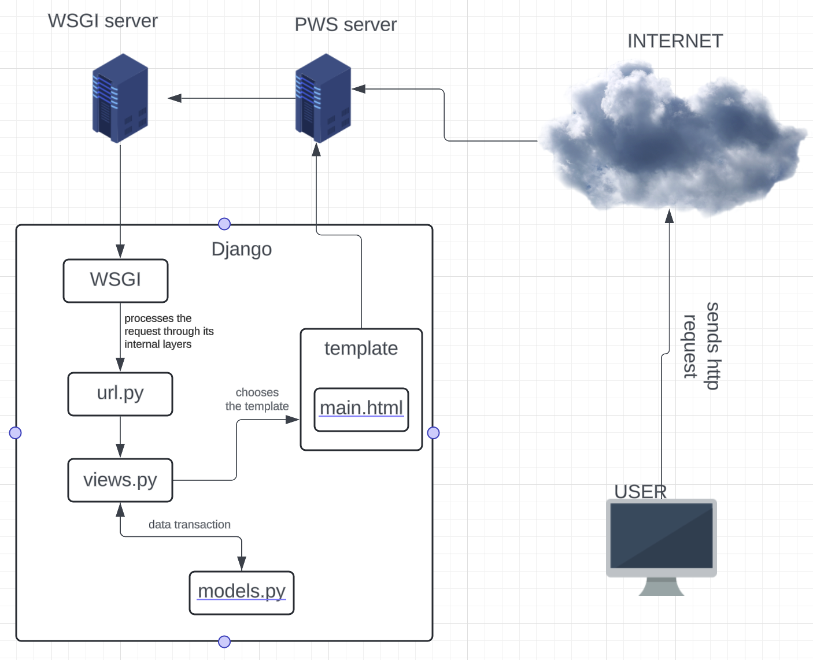

# Kanade Record Store

> **Kanade Record Store** adalah aplikasi penjualan dan pembelian rilisan fisik sepert vinyl, tape, dll untuk kawula muda yang kalcer abiez.

## 💿🥁🎹**Link**🎸🎻🎼
[Kunjungin laman Kanade Record Store](http://adam-caldipawell-kanaderecordstore.pbp.cs.ui.ac.id/)

<details>
<summary> <b> Tugas 2: Implementasi Model-View-Template (MVT) pada Django </b> </summary>

## Instruksi Setup Proyek

### 1. Membuat Directory Baru dan Menginisialisasi Git
1. Buat directory baru bernama `kanade-record-store`.
2. Inisialisasi repositori Git dan hubungkan ke GitHub:
    ```bash
    git init
    git remote add origin <URL>
    git add .
    git commit -m "Initial commit"
    git push origin master
    ```

### 2. Membuat Virtual Environment
1. Jalankan perintah berikut untuk membuat virtual environment:
    ```bash
    python -m venv env
    ```
2. Aktifkan virtual environment:
    - **Linux/macOS**:
        ```bash
        source env/bin/activate
        ```
    - **Windows**:
        ```bash
        env\Scripts\activate
        ```

### 3. Membuat dan Menginstall Requirements
1. Buat file `requirements.txt` yang berisi daftar package yang diperlukan.
2. Jalankan perintah berikut untuk menginstal package:
    ```bash
    pip install -r requirements.txt
    ```

### 4. Membuat Proyek Django
1. Buat proyek Django baru dengan nama `kanade_record_store`:
    ```bash
    django-admin startproject kanade_record_store
    ```
2. Buat aplikasi baru dengan nama `main`:
    ```bash
    django-admin startapp main
    ```

### 5. Mengupdate `settings.py`
1. Tambahkan aplikasi `main` ke dalam list `INSTALLED_APPS` di `settings.py` agar aplikasi tersebut terdaftar di proyek.
2. Tambahkan `"localhost"`, `"127.0.0.1"` ke dalam list `ALLOWED_HOSTS` untuk mengakses aplikasi secara lokal saat pengembangan.

### 6. Membuat View dan Template
1. Tambahkan kode berikut pada `views.py`:
    ```python
    from django.shortcuts import render

    def show_main(request):
        context = {
            'nama': 'Adam Caldipawell Sembiring',
            'class': 'PBP F'
        }
        return render(request, "main.html", context)
    ```
2. Di `urls.py`, tambahkan `path('', include('main.urls'))` pada `urlpatterns` agar URL aplikasi `main` bisa diakses.
3. Di folder `main`, buat folder bernama `templates` dan buat file `main.html` yang menampilkan nama e-commerce, nama, dan kelas.

### 7. Membuat Model Produk
1. Di `models.py`, buat model produk dengan atribut berikut:
    - `name`: CharField
    - `price`: IntegerField
    - `description`: TextField
      
### 8. Melakukan migration pada model
1. Pindah ke directory utama
2. Jalankan migration pada terminal:
   ```bash
   python manage.py makemigrations
   python manage.py migrate
   ```
### 9. Deploy ke PWS (Pacil Web Service)
1. Buat project baru di PWS dengan nama `kanaderecordstore` dan simpan credential information.
2. Di `settings.py`, tambahkan URL `adam-caldipawell-kanaderecordstore.pbp.cs.ui.ac.id/` ke dalam list `ALLOWED_HOSTS`.
3. Simpan perubahan dengan menjalankan:
    ```bash
    git add .
    git commit -m "Deploy to PWS"
    git push origin master
    ```
4. Tambahkan remote PWS:
    ```bash
    git remote add pws http://pbp.cs.ui.ac.id/adam.caldipawell/kanaderecordstore
    git branch -M master
    git push pws master
    ```

### 10. Aplikasi Django Terdeploy
Aplikasi sekarang bisa diakses melalui URL:  
[http://adam-caldipawell-kanaderecordstore.pbp.cs.ui.ac.id/](http://adam-caldipawell-kanaderecordstore.pbp.cs.ui.ac.id/)

## Bagan Proses Request Client ke Web Aplikasi

Berikut adalah alur proses dari request client ke web aplikasi berbasis Django:



### Penjelasan
1. Ketika user mengirimkan HTTP request ke server PWS, request tersebut diteruskan ke WSGI server.
2. WSGI server meneruskan request tersebut ke Django.
3. `urls.py` mendeteksi URL request dan menghubungkannya dengan views yang sesuai.
4. `views.py` memproses request dan mengambil data dari `models.py`.
5. `views.py` kemudian mengirimkan response berupa template HTML (`main.html`) yang akan dikembalikan ke user sebagai response.

## Fungsi Git dalam Pengembangan Perangkat Lunak
Git berfungsi sebagai version control dalam pengembangan perangkat lunak. Dengan Git, kita dapat melacak setiap perubahan kode yang dilakukan, memudahkan proses kolaborasi, dan memungkinkan rollback ke versi sebelumnya jika terjadi kesalahan.

## Mengapa Django Digunakan sebagai Permulaan Pembelajaran?
Django menggunakan bahasa Python yang relatif mudah dipahami. Django menawarkan arsitektur MVT (Model, View, Template), yang memisahkan komponen UI (template), logika aplikasi (view), dan akses database (model), sehingga memudahkan pengembangan terstruktur. Django juga memudahkan pengembang untuk membangun aplikasi yang skalabel.

## Mengapa Model di Django Disebut sebagai ORM?
Django menggunakan ORM (Object-Relational Mapping), yang memodelkan data dari database relasional menjadi objek di Python. Ini memungkinkan pengembang untuk berinteraksi dengan database tanpa harus menulis query SQL secara eksplisit, melalui QuerySet API yang disediakan oleh Django.
</details>
